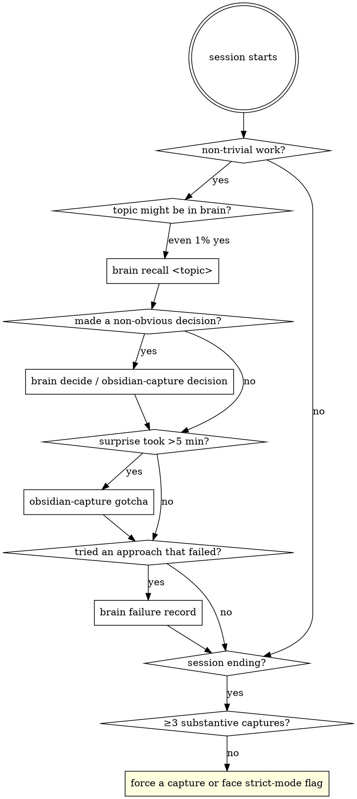

<SUBAGENT-STOP>
If you were dispatched as a subagent to execute a specific task, skip this skill — the parent agent handles brain discipline. Just do your task.
</SUBAGENT-STOP>

<EXTREMELY-IMPORTANT>
If you think there is even a 1% chance a brain skill might apply to what you are doing, you ABSOLUTELY MUST invoke it.

The agent brain is **only as useful as the discipline that feeds it**. Skipping recall because "I already know" silently atrophies the brain. Skipping capture because "the Stop hook will catch it" buries durable decisions in transcript noise that compaction will erase.

This is not negotiable. This is not optional. You cannot rationalize your way out of this.
</EXTREMELY-IMPORTANT>

## The brain in 30 seconds

The agent brain is a Postgres-backed persistent memory: structured captures (decisions / gotchas / patterns / failures), hybrid retrieval (FTS + BGE-M3 + reranker), session-lifecycle hooks (Stop / SessionEnd / PreCompact / SessionStart) that auto-flag failures and survive compaction.

You interact via skills (Skill tool) or CLI (`brain ...` via Bash). The brain stores; you retrieve and capture.

## When you must use the brain



## Session-start checklist (do this NOW if you just loaded this skill)

1. Did SessionStart inject a resume bundle (look for "Agent Brain resume bundle" in your initial context)? If yes, **read it** — that's your prior session's state.
2. Run `brain status` via Bash if no bundle was injected — see active projects, recent captures, recent failures.
3. For the user's first non-trivial request, **run `brain recall <topic>` BEFORE grepping code or reading files**. The brain is faster and richer than grep when there's a hit.

## In-session triggers

| Trigger | Skill / CLI | Why |
|---|---|---|
| Topic might be in the brain | `brain recall <query>` (Bash) or `agent-brain:brain-recall` (Skill) | FTS+vector lookup beats re-deriving |
| Non-obvious decision made | `agent-brain:brain-decide` for ADR; `agent-brain:obsidian-capture` for shorter | Survives compaction; resume bundle re-injects |
| Gotcha ate >5 min | `agent-brain:obsidian-capture` (type=gotcha) | Future-you grep-able |
| Approach failed, dead end | `brain failure record --target-problem <P> --attempted-approach <A> --outcome-evidence <E>` | Dedup-bumps retry_count if you try again |
| Multi-source synthesis | `agent-brain:brain-summarize` | Cited synthesis cached in brain |
| Need to ground a claim in source | `agent-brain:brain-cite` | Stops hallucinated citations |
| Comparing two sources | `agent-brain:brain-compare` | Structured agreements / disagreements |
| New ingest may supersede old | `agent-brain:brain-revise` | Proposes invalidations; human-gated |
| Found a useful link to add | `agent-brain:brain-link` | Builds the entity graph |
| Recall returned nothing on a topic that should be there | `brain compliance check --session-id <prior>` | Diagnose under-capture |

## Pre-exit checklist

Before the user `/exit`s or you finish a substantive session:

1. **Count your captures.** Did you record ≥3 things (decisions / gotchas / patterns / subtask summaries) this session? If not, **stop and capture now**.
2. **Strict mode warning:** if `brain_config.strict_mode = 'true'`, SessionEnd will exit non-zero for under-captured sessions. The next session sees a system reminder. You will be visibly noisy if you skipped capture.
3. **Failures not auto-flagged:** if you had a conceptual dead end (not a tool error), the Stop hook will miss it. Run `brain failure record` manually.
4. **Multi-source work:** if you read 3+ sources, consider `brain-summarize` to leave a synthesized note for next time.

## Red flags — STOP if you catch yourself thinking these

| Thought | Reality |
|---|---|
| "I already know this; recall is overhead" | You don't. Recall is < 2 seconds. The brain knows things your context window doesn't. |
| "The Stop hook will catch it" | Stop hook catches tool failures, not conceptual ones. Real decisions need `brain-decide`. |
| "This isn't worth capturing" | If it took >5 minutes to figure out, future-you will pay >5 minutes again. Capture. |
| "Recall returned empty, the brain doesn't have it" | Empty recall is data — note the gap. Next non-trivial work in this area should leave a capture. |
| "I'll capture at the end" | You won't. Capture at the breakpoint. End-of-session is for review, not deferred work. |
| "Auto-capture is good enough" | Auto-capture has ~50% false-positive rate per BUGS.md. Real decisions need explicit capture. |

## Capture taxonomy quick-reference

```
decision        — ADR-shaped choice with rationale ("we chose X over Y because Z")
gotcha          — non-obvious behaviour that ate time ("::jsonb breaks SQLAlchemy binds")
pattern         — reusable approach ("when X, prefer Y first")
note            — observation, fact, glossary entry
subtask_summary — outcome of one task with its constraints + result
session_summary — what this whole session accomplished
failure_memories (typed table) — target_problem × attempted_approach × outcome_evidence (with retry_count dedup)
```

Each lives in `sources` with the right `kind`; failure_memories is also surfaced in a typed table for structured "have we tried this?" lookup.

## How to invoke skills here

- **Slash command:** `/using-agent-brain` reloads this skill.
- **Skill tool:** `Skill(skill="agent-brain:brain-recall", args="<query>")` for skill-mediated invocation.
- **CLI:** `brain <subcommand>` via Bash for direct DB writes / reads.

CLI is fastest for short interactions; Skill tool is right when the skill body has guidance you should read.

## What this skill is NOT

- **Not a substitute for thinking.** Recall before work, capture after, doesn't replace doing the work right.
- **Not perfect retrieval.** FTS is brittle on synonyms; semantic retrieval is in Phase 2 but may not be populated. If recall returns nothing, fall back to grep + leave a capture.
- **Not silent.** The Stop hook and SessionEnd hook write to the brain whether you invoke skills or not. Your job is the substantive captures (decisions, gotchas, patterns) — the hooks handle lifecycle + failure noise.
